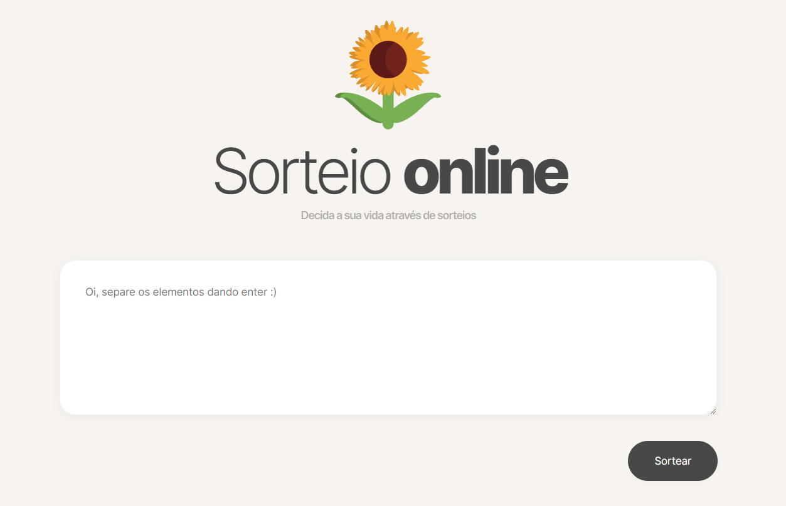

<h1 align="center"> Sorteio Online </h1>

  

## 🚀 Tecnologias

Esse projeto foi desenvolvido com as seguintes tecnologias:

- HTML e CSS
- JavaScript
- Criação da interface no figma

## 💻 O projeto

Página de sorteio criada utilizando javascript puro. 

- [https://flavialbraz.github.io/sorteador/home](https://flavialbraz.github.io/sorteador/home)

Feito com 💜

 
